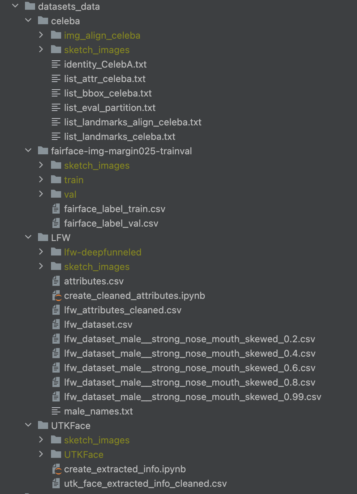

# Image fairness


## Dataset setup

### CelebA
The CelebA dataset is downloaded via the pytorch torchvision library. This means you usually don't need t do 
anything and can just run the benchmarks with this dataset. However, due to the dataset hosting it can happen that the 
daily request quota is exceeded which leads to a failing download. If this happens you need to download the dataset 
manually from the [official website](https://mmlab.ie.cuhk.edu.hk/projects/CelebA.html). Download the Align&Cropped 
Images folder as well as all annotations. The train test split is not required, as this will be handled by the 
torchvision library. Create a directory called `celeba`inside the dataset directory and copy the `img_align_celeba`
folder that contains the images as well as all annotation files into it.

### FairFace
The dataset can be downloaded from the [official GitHub repository](https://github.com/dchen236/FairFace?tab=readme-ov-file#data). For the thesis the dataset version with padding=0.25 is used. Copy the folder with the 
images into the dataset folder. Then download the train and val csv file and copy them into the fairface image 
folder (the folder should have the name `fairface-img-margin-025-trainval`)

### UTKFace

Down the UTKFace dataset with cropped images from https://www.kaggle.com/datasets/jangedoo/utkface-new. Use the provided jupyter notebook `create_extracted_info.jpynb` to extract the attributes from the filenames and to crate a csv file with all attribute data.

### LFW

Download the lfw images aligned with deep funneling from the official website (http://vis-www.cs.umass.edu/lfw/lfw-deepfunneled.tgz). Furthermore, download the attributes (http://www.cs.columbia.edu/CAVE/databases/pubfig/download/lfw_attributes.txt) and the manually verified gender labels (http://bit.ly/lfw-gender) 
Use the provided jupyter notebook `create_cleaned_attributes.jpynb` to create a unified and cleaned csv file that contains the gender and attribute information.

### Complete dataset directory
The dataset directory should then look like this. The sketch images and skew datasets are only available once the corresponding generation scripts have been executed. 



## Fairness approaches


### In-processing
| Approach Name               | Paper Name                                                                                                             | Description                                                                                                                        | Link                                                                                                                                                            |
|-----------------------------|------------------------------------------------------------------------------------------------------------------------|------------------------------------------------------------------------------------------------------------------------------------|-----------------------------------------------------------------------------------------------------------------------------------------------------------------|
| Adversarial Debiasing       | Mitigating Unwanted Biases with Adversarial Learning                                                                   | Adversarial Training approach (AIF nad Fairlearn implementation available)                                                         | https://dl.acm.org/doi/pdf/10.1145/3278721.3278779                                                                                                              |
| Orthogonal Representations  | On Fairness of Medical Image Classification with Multiple Sensitive Attributes via Learning Orthogonal Representations | Pursue independence between protected feature an target by achieving orthogonality in the representation space                     | https://link.springer.com/chapter/10.1007/978-3-031-34048-2_13                                                                                                  |
| Domain Independent Training | Towards Fairness in Visual Recognition: Effective Strategies for Bias Mitigation                                       | Domain independent training technique (Shared feature representation with ensemble classifiers)                                    | https://openaccess.thecvf.com/content_CVPR_2020/papers/Wang_Towards_Fairness_in_Visual_Recognition_Effective_Strategies_for_Bias_Mitigation_CVPR_2020_paper.pdf |
| Entangling Disentangling    | EnD: Entangling and Disentangling deep representations for bias correction                                             | Regularize the training by inserting an information bottleneck                                                                     | https://openaccess.thecvf.com/content/CVPR2021/papers/Tartaglione_EnD_Entangling_and_Disentangling_Deep_Representations_for_Bias_Correction_CVPR_2021_paper.pdf |
| Adversarial Shared Encoder  | Fair Image Classification with Semi-Supervised Learning                                                                | Adversarial approach                                                                                                               | https://hci.stanford.edu/courses/cs335/2020/sp/hocarolinecinkay_37018_6192239_Final_Report.pdf                                                                  |
| Fair Contrastive Learning   | Fair Contrastive Learning for Facial Attribute Classification                                                                                              | Use a fair contrastive loss function for visual representation learning                                                            | https://arxiv.org/pdf/2203.16209.pdf                                                                                                                            |
| Fair Feature Distillation   | Fair Feature Distillation for Visual Recognition                                                                       | Improve fairness of an already trained model via feature distillation                                                              | https://arxiv.org/pdf/2106.04411v2.pdf   |


### Loss function modifications
|           | Approach                                                                | Description                                                                                                                                  | Link                                  |
|-----------|-------------------------------------------------------------------------|----------------------------------------------------------------------------------------------------------------------------------------------|---------------------------------------|
| BASE Loss | A Differentiable Distance Approximation for Fairer Image Classification | Loss function contains a differentiable approximation of the accuracy across demographics to  learn a model which is fair with respect to EO | https://arxiv.org/pdf/2210.04369.pdf  |

### Postprocessing
|                         | Approach                                                                                             | Description                                                                                                    | Link                                  |
|-------------------------|------------------------------------------------------------------------------------------------------|----------------------------------------------------------------------------------------------------------------|---------------------------------------|
| Blackbox Postprocessing | Blackbox Postprocessing for Multiclass Fairness                                                      | Linear programming is used to achieve fairness                                                                 | https://arxiv.org/pdf/2201.04461.pdf  |

### Hybrid methods
|                 | Approach                                                 | Description                                                                                | Link                                     |
|-----------------|----------------------------------------------------------|--------------------------------------------------------------------------------------------|------------------------------------------|
| Image Sketching | Improving Fairness in Image Classification via Sketching | Sketch images are used together with a modified loss function that is as a MSE loss of SPD | https://arxiv.org/pdf/2211.00168.pdf     |

## Execute experiments

To train the models und execute the experiments, the following scripts can be used:
- **run_baseline.py**: Train the baseline model
- **run_experiment.py**: Train all mitigation approaches
- **run_tests.py**: Evaluate baseline and all mitigation approaches with the test data
- **run_latent_embedding_generation.py**: Generate latent embeddings for t-SNE plots

All scripts can be executed via the terminal and support the same parameters:

```
python ./src/<script_name>.py --dataset_name <dataset_name> --baseline_path_version <baseline_model_path> --model_path_version <mitigation_models_path_name> --batch_size <batch size> --device <device>
```

Default values for the parameters or available options can be looked up in the script .